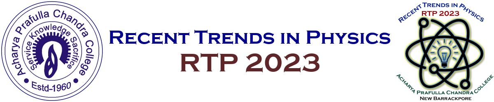
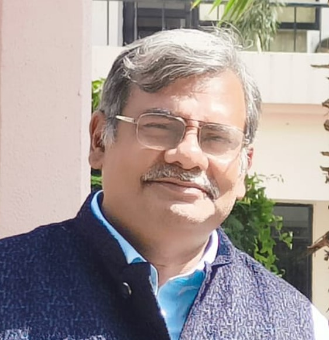
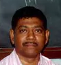
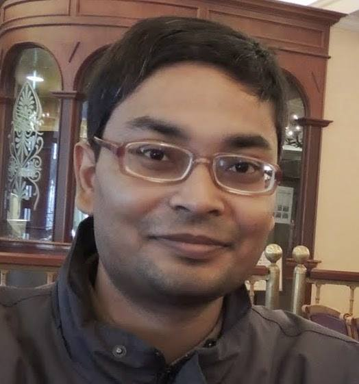
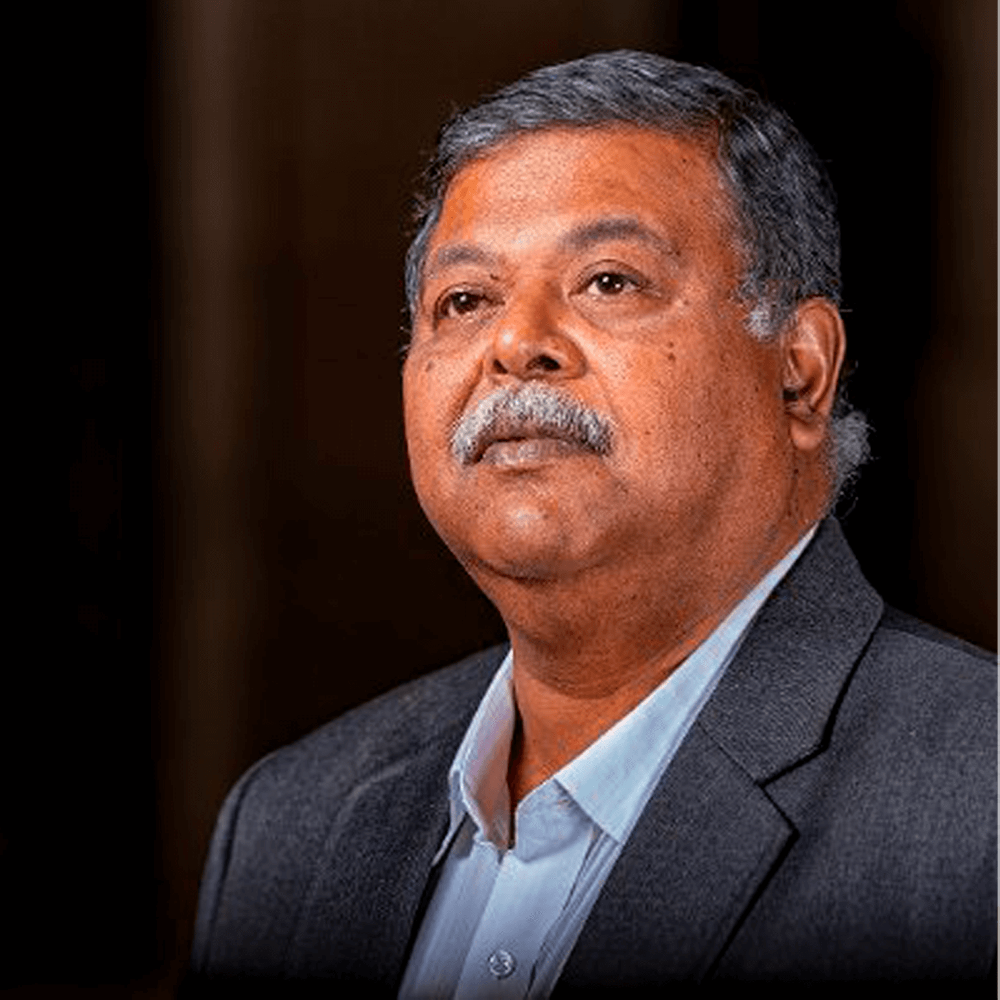

# 
The Department of Physics, in collaboration with the IQAC of Acharya Prafulla Chandra College, New Barrackpore, Kolkata 700131, is organizing a two-day national-level seminar on the 28th and 30th of June, 2023.

This seminar aims to provide a dynamic platform for students and teachers to gain exposure to different areas of physics. In students, this will hopefully enhance the love for physics. For teachers and researchers, this will give ideas about different areas to explore in their research. This will also be a platform for similar minded people to discuss and exchange ideas.

Our invited speakers will cover topics covering areas in condensed matter theory, quantum mechanics, mathematical physics, non-equilibrium statistical physics, astronomy and astrophysics. In addition, there will be contributed talks covering other areas of physics. Participants will leave with a flavour of a vast array of ideas and information in physics for future study and research.

## Invited Speakers
\
Dr. Ananda Dasgupta\
Associate Professor, Indian Institute of Science Education and Research Kolkata\
Topic: _Quantum Mechanics_

---

\
Dr. Debnarayan Jana\
Professor, Department of Physics, University of Calcutta\
Topic: _Dirac Materials_

---

\
Dr. Sourabh Lahiri\
Assistant Professor, Department of Physics, Birla Institute of Technology Mesra\
Topic: _Non-equilibrium Statistical Mechanics_

---

\
Dr. Debiprosad Duari\
Former Director\
M. P. Birla Institute of Fundamental Research\
Topic: _Astronomy & Astrophysics_
         
---

## Call for participation and presentation
We invite faculty, research scholars and students to participate in this seminar. Registration is mandatory. A limited number of oral and poster presentations will be arranged. For this, please prepare an abstract in the format given below and submit it with the registration form.}

### Registration fees
Faculty: ₹1,000\
Research Scholars: ₹800\
B.Sc. and M.Sc. Students: ₹300

[Registration form for faculty and research scholars](https://forms.gle/A6pFQkeEtvaK1A5N7)\
[Registration form for students](https://forms.gle/KeTHjTRiLeCynNok7)\
[Template for abstract](https://1drv.ms/w/s!AutIDylz5NnkgXeO_iwvjqupcMAU?e=8qbgL4)

* The last date for registration has been extended to the 21st of June, 2023. *

## Advisory Committee
- Dr. Anirban Saha
- Dr. Arunava Chakrabarti
- Dr. Partha Pratim Ray
- Dr. Salil Kumar Biswas
- Dr. Sourish Banerjee
- Dr. Nikhil Chandra Halder
- Dr. Saktibtata Bhowmik
- Dr. Partha Sarathi Majumdar
- Dr. Sukhamoy Bhattacharyya

## Organizing Committee
- Chairman: Dr. Syed Rafi Ahmed
- Convener: Dr. Indranil Bhattacharyya
- Joint Conveners: Dr. Atanu Nandy, Dr. Saurish Chakrabarty, Mrs. Anamika Das, Md Moinul Islam
- Secretary: Dr. Goutam Biswas
- Treasurers: Dr. Ananda Sarkar, Mr. Pradip Bose
